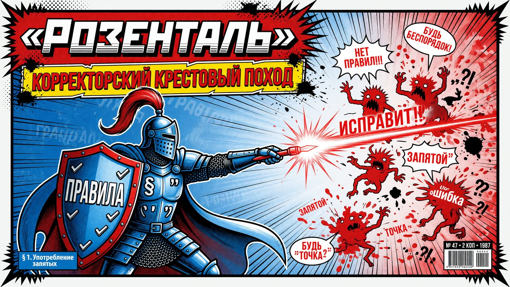

<p align="center">
  
</p>

# Розенталь

> **Claude Code-скил (команда `/rozental`): корректор русского текста. Орфография, пунктуация, согласование, управление, языковое единообразие. НЕ смысл и не голос — только формальные ошибки нормы. НЕ типографика — ёлочки, тире-форма, неразрывные пробелы и юникод формализуются без понимания смысла и делаются детерминированным скриптом, отдельный инструмент. Два режима: разобрать со ссылками на § правил или вычитать на месте. Главный принцип — precision важнее recall: гиперкоррекция (исправление верного на неверное) для корректора хуже пропуска.**

[](LICENSE)
[](https://docs.claude.com/en/docs/claude-code/overview)

Даёте текст — Claude проходит по нему как корректор: орфография (-тся/-ться, н/нн, словарные
опечатки), пунктуация (обособления, парные знаки, прямая речь, слова-ловушки), согласование
и управление, языковое единообразие (написания имён, заглавные, сокращения). Возвращает
таблицу флагов с цитатами, обязательной ссылкой на правило — и (в режиме Правка) вычитанный
текст. Спорное и редполитика молча не правятся. Типографика — отдельная задача.

```
/rozental <вставьте текст>
→ Режим: Правка. Найдено правок: 9 (орфо: 2, пункт: 4, согл: 2, ед-во: 1).
→ ВЫЧИТАННЫЙ ТЕКСТ: ...
→ На решение автора: 2 спорных места — ёфикация, тире vs двоеточие в БСП.
```

---

## Зачем

Главная ошибка инструмента-корректора — **гиперкоррекция:** исправление верного на неверное.
LLM-корректура часто ставит запятые перед «вряд ли», переделывает авторскую парцелляцию в
«классическое» обособление, навязывает один из равноправных вариантов нормы как единственно
правильный. Получается вычитанный, но искажённый текст. Пропуск читается как «нормальный
скил, не дотянул»; ложная правка — как «скил испортил текст». Второе хуже.

«Розенталь» собран против этой ошибки. Имя — в честь Дитмара Эльяшевича Розенталя, чей
«Справочник по правописанию и литературной правке» полвека был библией русского корректора.
Принцип скила — **бинарный фильтр с почти нулём ложных срабатываний:** где правило однозначно,
правлю; где норма допускает варианты, выбирает автор; где спорно — оставляю и помечаю.

## Как работает

В основе — четыре правила, без которых скил вредит:

1. **Норма → править молча.** Где правило однозначно (-тся/-ться, согласование, словарная
   орфография, обязательная пунктуация) — править. Тест: **назови § правила.**
   Не можешь назвать — не правь.
2. **Вариант → не навязывать.** Где норма допускает оба (% с пробелом/без, инициалы,
   тире↔двоеточие в БСП, «по вам/по вас») — корректор НЕ выбирает за автора. Он приводит
   к **единообразию** в пределах текста.
3. **Редполитика → не трогать.** Сплошная ёфикация, «в/на Украине», «большинство пришло/
   пришли» — вне зоны корректора. Максимум — пометить.
4. **Авторская пунктуация — приём, не ошибка.** В худ./экспрессивном тексте намеренное
   отступление (парцелляция, интонационное тире, многоточие-приём) — оставить. Но
   грамматику/орфографию (-тся, согласование, опечатки) правлю и в авторском тексте.

Пять проходов:

1. **Орфография.** -тся/-ться (вопрос к глаголу); н/нн; слитно/раздельно/дефис; «не» с
   частями речи; приставки пре-/при-, з/с; чередующиеся корни; о/ё после шипящих; заглавные;
   словарные опечатки по closed-list.
2. **Пунктуация.** Запятые (однородные, ССП/СПП, обособления), тире и двоеточие в БСП
   (выбор знака по смыслу — форма длинного/короткого тире и неразрывных пробелов вокруг
   уже задача типографа), прямая речь, **слова-ловушки** (вряд ли, якобы, будто, ведь, как
   раз, всё-таки — НЕ выделять запятыми).
3. **Согласование и управление.** Числительные, собирательные («двое суток»), сказуемое при
   «большинство/ряд/часть», аббревиатуры, трудные пары управления (согласно + дательный;
   оплатить что / заплатить за что).
4. **Языковое единообразие.** Собрать разнобой в **языковых формах** (написания имён и
   терминов, заглавные в составных названиях, сокращения-аббревиатуры, словарные варианты)
   и привести к одному канону. Спорное — в «На решение автора», не молча. Графическое
   единообразие (кавычки, форма тире, формат чисел/дат) — задача типографа, не корректора.
5. **Самопроверка (анти-гиперкоррекция).** Перечитать правки: каждая опирается на §?
   Не исправил ли верное? Не тронул ли авторский приём? Каждая правка грамматична сама
   по себе — не создал ли висячий оборот, новое рассогласование, потерю смысла.

## Зоны решений (зачем это важно)

Главная развилка любого спорного места: куда оно идёт.

| Зона | Что это | Что делает корректор |
|------|---------|----------------------|
| **Норма** | Однозначное правило (§ есть) | Правит молча |
| **Вариант** | Норма допускает оба | Приводит к единообразию; выбор молча — по доминирующему варианту, при равенстве — к автору |
| **Редполитика** | Сплошная ёфикация, «в/на Украине», феминитивы | Не трогает; максимум помечает |
| **Авторский приём** | Парцелляция, интонационное тире, многоточие-приём | Оставляет |

Без этого разделения корректор скатывается либо в безразличие («ничего не правлю, всё может
быть приёмом»), либо в гиперкоррекцию («всё неоднозначное — в правки»). Оба плохи.

## Режимы работы

| Режим | Когда | Что делает |
|-------|-------|------------|
| **Правка** (по умолчанию) | «вычитай», «корректор», «поправь ошибки», «/rozental» | разбирает + правит + отдаёт текст |
| **Разбор** | «только ошибки», «корректорский разбор», «что не так с пунктуацией» | список с § правил, текст не трогает |

<p align="center">
  <br>
  <sub><i>Корректорский крестовый поход против гиперкоррекции</i></sub>
</p>

## Установка

Скил — это два файла в папке `.claude/`. Скопируйте их в свой проект **или** в глобальную
папку Claude Code (`~/.claude/`), чтобы скил был доступен везде.

**В конкретный проект:**
```bash
git clone https://github.com/beaverbeard/rozental.git
cp -r rozental/.claude/skills/rozental      .claude/skills/
cp    rozental/.claude/commands/rozental.md .claude/commands/
```

**Глобально (во все проекты):**
```bash
cp -r rozental/.claude/skills/rozental      ~/.claude/skills/
cp    rozental/.claude/commands/rozental.md ~/.claude/commands/
```

Перезапустите Claude Code — скил «Розенталь» (`rozental`) и команда `/rozental` появятся в списке.

## Использование

```bash
# Вставить текст прямо в команду
/rozental <вставьте текст>

# Или вызвать команду и вставить текст следующим сообщением
/rozental

# Только разбор, без правки
/rozental только ошибки: <текст>
```

Или просто словами: «вычитай этот текст», «прогони через Розенталя», «поправь пунктуацию».

## Что Розенталь правит

Несколько примеров из чек-листа:

- **Орфография:** -тся/-ться по вопросу к глаголу; н/нн; «не» по частям речи; пре-/при-, з/с;
  чередующиеся корни; о/ё после шипящих; заглавные. Словарные опечатки по closed-list
  (в течение, агентство, прийти, вряд ли, как будто).
- **Пунктуация:** обособление определений/обстоятельств/приложений/уточнений; парные знаки
  (оборот закрыт с обеих сторон); деепричастный и причастный обороты; сравнительный «как»;
  тире/двоеточие в БСП **по смыслу** (форма знака — типография); прямая речь.
- **Слова-ловушки:** «вряд ли», «якобы», «будто», «ведь», «как раз», «всё-таки», «тем не
  менее», «в конечном счёте» — **НЕ выделять запятыми.** Это самая частая ложная правка.
- **Согласование:** числительные (двое суток, к 2026 году, оба/обе); «большинство пришло/
  пришли» по смыслу; аббревиатуры («МГУ объявил»).
- **Управление:** согласно/благодаря/вопреки + дательный; оплатить что / заплатить за что;
  по окончании/приезде.
- **Языковое единообразие:** написания имён/терминов, заглавные в составных названиях,
  сокращения-аббревиатуры — один канон в пределах текста.

Полный список — в [`SKILL.md`](.claude/skills/rozental/SKILL.md).

## Что Розенталь НЕ делает

- **Не правит типографику.** Ёлочки/лапки, длинное/короткое тире/дефис, неразрывные пробелы,
  многоточие, омоглифы, zero-width, BOM, mojibake — это не корректура. Эти правила
  формализуются без понимания смысла и применяются детерминированным скриптом, не LLM.
  Отдельная задача, отдельный инструмент.
- **Не правит смысл, структуру, голос.** Это работа литературного редактора. Скил-корректор
  не переписывает фразы — даже неуклюжие. Только формальные ошибки.
- **Не ловит AI-маркеры и нейрослоп.** Это отдельный детектор, у него другая логика
  (статистические паттерны машинной генерации).
- **Не навязывает варианты.** Там, где норма допускает оба, корректор приводит к
  единообразию и помечает спорное — но не выбирает за автора.
- **Не трогает редполитику.** Ёфикация, «в/на Украине», феминитивы — вне зоны корректора.
- **Не правит авторскую пунктуацию.** Парцелляция, интонационное тире, многоточие-приём —
  оставляются. Признаки приёма: системность, восстановимая интонация, смысловая нагрузка.
- **Не проверяет факты.** Сомнительные цифры/даты/имена — не корректорская работа.
- **Не правит цитаты.** Чужой текст в кавычках — только очевидные опечатки набора,
  не нормализация чужой пунктуации.

## Настройка под себя

Скил **opinionated в части precision-bias:** при сомнении он скорее оставит, чем поправит.
Если ваша задача — школьное сочинение или строгий деловой документ, где нужна максимальная
вычитка любой ценой, можно ослабить тест § правила в `SKILL.md`. Если задача — художественный
текст с большим количеством авторской пунктуации, наоборот стоит расширить раздел про
авторский приём.

Особенно полезно подкрутить:
- **Closed-list словарных опечаток** — добавить отраслевую лексику.
- **Слова-ловушки** — расширить под свой жанр.
- **Языковое единообразие** — зафиксировать стайл-лист (как пишутся бренды, имена, термины
  в этом проекте).

## Ограничения

- **Только русский.** Правила, closed-list и тесты собраны под русскоязычный текст.
- **Не факт-проверка.** Скил не ходит во внешние источники проверять цифры/даты/имена.
- **Не редактура.** Смысл, структура, ясность, голос — другая задача.
- **Не типограф.** Ёлочки, форма тире, NBSP, юникод — другая задача (детерминированный
  скрипт, не LLM).
- **Не детектор AI.** Стилистические маркеры машинной генерации — другая задача.
- **Opinionated на precision.** На спорных местах скил скорее оставит, чем поправит — это
  сознательный выбор, не баг.

## FAQ

**Это переписывает мой текст?** Нет. Розенталь — корректор, а не редактор. Он правит только
формальные ошибки нормы (орфография, пунктуация, согласование, языковое единообразие) и не
трогает фразы, даже если они неуклюжие. Если фраза грамматически верна, корректор её не меняет.

**Чем отличается от редактора?** Редактор работает со смыслом и
формой: канцелярит, цепи родительных, неясный тезис, сломанная структура, длинные
предложения. Корректор работает с буквой: -тся/-ться, запятые, согласование. Это разные
задачи, обычно делаются последовательно — сначала редактор, потом корректор.

**Чем отличается от типографа?** Типограф работает с **формой знака** — ёлочки vs прямые
кавычки, длинное/короткое тире/дефис, неразрывные пробелы, многоточие, омоглифы. Это
формализуется без понимания смысла и применяется детерминированным скриптом (не LLM),
поэтому это отдельный инструмент. Корректор работает с **буквой нормы** — там, где для
правки нужно понять смысл фразы.

**Чем отличается от чистильщиков AI-текста?** Чистильщики AI ищут статистические паттерны
машинной генерации (нейротропы, переходные обороты «давайте поговорим о…», паттерны
структуры абзацев). Корректор ищет ошибки нормы. Это разные задачи; на одном тексте они
часто не пересекаются — AI-маркер может быть грамматически безупречен.

**Что такое «слова-ловушки»?** Слова и обороты, которые часто **ложно** выделяют запятыми:
«вряд ли», «якобы», «будто», «ведь», «как раз», «всё-таки», «тем не менее», «в конечном
счёте». Они **не вводные** и запятыми не отделяются. Это самая частая категория
гиперкоррекции — поэтому она вынесена в отдельный пункт.

**Что такое «На решение автора»?** Раздел вывода, в который идёт всё спорное: вариант
нормы (тире или двоеточие в БСП), вопрос редполитики (ёфикация), потенциальный авторский
приём (парцелляция). Это **не правки** — в финальный текст не вносятся. Решает автор.

**Розенталь правит авторскую пунктуацию?** Нет, если это пунктуация-приём (системная,
восстанавливает интонацию, несёт смысл). Парцелляция «Шёл. Споткнулся. Упал.» — приём,
не ошибка. Интонационное тире, многоточие-приём — то же. Но грамматику и орфографию
(-тся, согласование, опечатки) корректор правит даже в авторском тексте.

**А если я не согласен с правкой?** Каждая правка в таблице снабжена ссылкой на правило
(колонка «Правило / §»). Если правка ставит запятую — должен быть параграф, который этого
требует. Не можете найти параграф — правка скорее всего ошибочна, верните автору в
исходный вид и сообщите issue.

**Почему так осторожно с правками?** Гиперкоррекция (исправление верного на неверное) для
корректора хуже пропуска. Пропущенная ошибка читается как «корректор не дотянул»; ложная
правка — как «корректор испортил текст». Второе хуже. Поэтому на чистом тексте правок быть
не должно.

## Вклад

PR и issue приветствуются. Скил — это обычный Markdown в `.claude/skills/rozental/SKILL.md`,
менять легко. Идеи: расширенный closed-list словарных опечаток, профили под отраслевую
терминологию (юр./мед./IT), стайл-листы под издания, английская версия.

## Лицензия

[MIT](LICENSE) © 2026 Rodion Scryabin ([@beaverbeard](https://github.com/beaverbeard))
